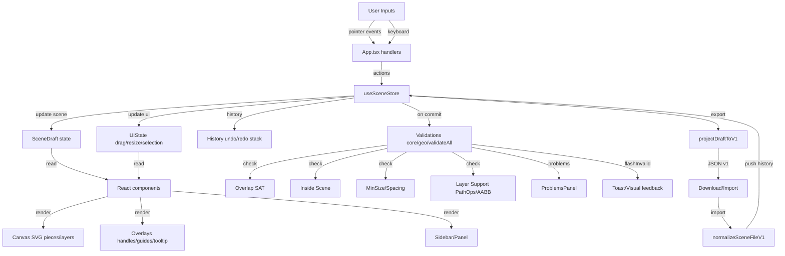
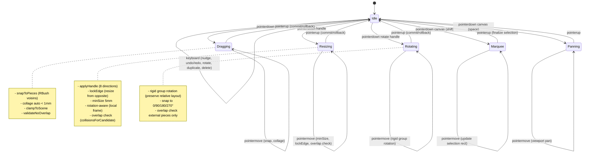

# Rapport de Reprise Projet — Éditeur Décor WYSIWYG

**Date :** 2025-11-08
**Version projet :** v0.4.3-alpha (tag wip-20251102-2337)
**Branche :** main
**Statut :** Développement actif, CI fonctionnelle, quelques régressions typecheck

---

## A. TL;DR (15 lignes max)

**État global :** Projet React+TS+Vite+Zustand en bonne santé structurelle. 108 fichiers src/, ~6k lignes. Architecture modulaire (core/lib/state/ui). Tests unitaires Vitest (589 passed, 4 failed) + E2E Playwright (26 specs). CI GitHub Actions (typecheck + e2e) avec cache pnpm activé.

**Points forts :** Commits Conventional ✅, architecture propre (geo/spatial/snap/validation séparés), RBush+SAT intégrés, PathOps WASM pour booléens, système de layers 3 couches (C1/C2/C3), snap précis (0/1.5mm), historique undo/redo, export JSON fidèle.

**Risques majeurs :**

1. **Typecheck BLOQUE build** (186 erreurs TS implicites `any`, types manquants sur SceneDraft.revision, selectors non typés).
2. **3 tests unitaires cassés** sur resize isotrope groupe (flashInvalidAt undefined).
3. **Lint warning** : 200+ `@typescript-eslint/no-explicit-any` dans e2e/ et src/.
4. **PathOps** : dépendance WASM fragile (fallback AABB présent mais non testé en profondeur).

**5 Next Steps (2 sprints) :**

1. **Sprint 1.1** : Fixer types useSceneStore (revision, selectors) → débloquer build.
2. **Sprint 1.2** : Corriger tests resize isotrope (flashInvalidAt).
3. **Sprint 1.3** : Ajouter job `lint` + `build` à CI (actuellement typecheck+e2e only).
4. **Sprint 2.1** : Typer helpers e2e (`getStoreSnapshot`, `getScenePieces`).
5. **Sprint 2.2** : Documenter stratégie PathOps fallback (tests manuels AABB, scénarios sans WASM).

---

## B. Arborescence Commentée + Pièces Clés

### Structure générale (tree condensé)

```
editeur-decor/
├── .github/workflows/e2e.yml    # CI: typecheck + e2e (Node 20, pnpm cache ✅)
├── docs/                         # 7 fichiers MD (contracts, config, debug reports)
├── e2e/                          # 26 specs Playwright (layers, resize, rotate, snap, pathops)
├── scripts/
│   ├── doctor.sh                 # Healthcheck (ports, preview, playwright)
│   └── verify-pathops.js         # Vérifie chargement WASM
├── src/
│   ├── App.tsx                   # 947 lignes — composant principal, gestion gestes (drag/resize/rotate)
│   ├── main.tsx                  # Entry point, init store, seed scene
│   ├── state/
│   │   └── useSceneStore.ts      # 3300+ lignes — store Zustand (scene, ui, history, layers, gestes)
│   ├── core/
│   │   ├── booleans/pathopsAdapter.ts  # Wrapper PathKit WASM (union, difference, intersect)
│   │   ├── collision/sat.ts            # SAT.js pour détection overlap rectangles rotés
│   │   ├── geo/
│   │   │   ├── validateAll.ts          # Validations fabricabilité (overlap, inside, minSize, spacing, support)
│   │   │   ├── geometry.ts             # AABB rotés, corners, SAT polygons
│   │   │   ├── facade.ts               # Wrapper async validateOverlapsAsync (PathOps via worker?)
│   │   │   └── transform.ts            # Matrices de transformation (rotation rigide groupe)
│   │   ├── spatial/rbushIndex.ts       # RBush pour requêtes voisins (snap, overlap)
│   │   └── snap/candidates.ts          # Pré-filtre voisins snap via RBush
│   ├── lib/
│   │   ├── geom/                       # AABB, drag, clamp
│   │   ├── ui/
│   │   │   ├── snap.ts                 # 600+ lignes — snap pieces/groupe, guides, collage 0/1.5mm
│   │   │   ├── resize.ts               # Resize handles (8 directions), lockEdge, minSize, rotation
│   │   │   ├── matrix.ts               # Matrices 2D pour resize groupe isotrope
│   │   │   └── keyboardStep.ts         # Nudge clavier (smart snap pré-collage)
│   │   ├── sceneRules/             # Validations (overlap, inside scene)
│   │   ├── io/schema.ts            # Export/import JSON v1
│   │   ├── spatial/globalIndex.ts  # Index spatial global (RBush++)
│   │   └── drafts/                 # localStorage drafts (save/load brouillons)
│   ├── components/
│   │   ├── Sidebar.tsx             # Panel layers, materials, rotate, nudge
│   │   ├── ProblemsPanel.tsx       # Affichage problèmes (overlap, spacing, support)
│   │   ├── Toast.tsx               # Notifications UI
│   │   └── ui/                     # Shadcn components (button, card)
│   ├── ui/overlays/
│   │   ├── SelectionHandles.tsx    # 8 resize handles + rotation handle
│   │   ├── GroupGhostOverlay.tsx   # Preview fantôme multi-sélection
│   │   ├── GroupResizePreview.tsx  # Preview live resize groupe isotrope
│   │   └── MicroGapTooltip.tsx     # Tooltip gap temps réel (drag)
│   ├── constants/
│   │   ├── validation.ts           # MIN_GAP_MM=1.0, SPACING_WARN_MM=1.5, SNAP_EDGE_THRESHOLD_MM=1.0
│   │   ├── ui.ts                   # Constantes UI (tooltip, collage)
│   │   └── scene.ts                # Dimensions scène par défaut
│   └── types/
│       └── scene.ts                # Types de base (Piece, Layer, SceneDraft, Milli, Deg, BBox)
├── tests/                          # 41 specs unitaires (contracts, geo, pathops, spacing, layers)
├── package.json                    # pnpm workspace, scripts dev/build/test/e2e
├── tsconfig.json + .app + .node    # TS strict: true, isolatedModules, noFallthroughCasesInSwitch
├── .eslintrc.cjs                   # ESLint + prettier, import order, no-console warn
├── playwright.config.ts            # Playwright chromium, webServer vite dev, traces on failure
└── vite.config.ts                  # Vitest jsdom, coverage text+html
```

### Résumé fichier par fichier (pièces clés)

| Fichier                                                                    | Lignes | Rôle                                                                                                                                                                                                                                                  |
| -------------------------------------------------------------------------- | ------ | ----------------------------------------------------------------------------------------------------------------------------------------------------------------------------------------------------------------------------------------------------- |
| [src/state/useSceneStore.ts](src/state/useSceneStore.ts)                   | 3300+  | **Store central** Zustand : scene (pieces/layers), ui (selection/drag/resize), history (undo/redo), actions (insertRect, movePiece, rotatePiece, resizePiece, duplicatePiece, deletePiece, layers CRUD, drafts save/load, snap/collage, validations). |
| [src/App.tsx](src/App.tsx)                                                 | 947    | Composant principal : canvas SVG, gestion événements (pointermove/pointerdown/pointerup), hooks gestes (drag/resize/rotate), rendu pièces/layers/guides/handles.                                                                                      |
| [src/core/geo/validateAll.ts](src/core/geo/validateAll.ts)                 | 580    | Validations fabricabilité : overlap same layer (SAT), inside scene, minSize (5mm), spacing (≥1mm BLOCK, ≥1.5mm OK), layer support (PathOps exact ou AABB fallback).                                                                                   |
| [src/lib/ui/snap.ts](src/lib/ui/snap.ts)                                   | 600+   | Snap pieces/groupes (RBush voisins), guides visuels, collage automatique 0mm (si gap<1mm) ou 1.5mm (attache explicite), normalisation gap.                                                                                                            |
| [src/lib/ui/resize.ts](src/lib/ui/resize.ts)                               | 400+   | Resize handles 8 directions (n/s/e/w/ne/nw/se/sw), lockEdge (resize from opposite edge), minSize 5mm, rotation-aware (local frame).                                                                                                                   |
| [src/core/spatial/rbushIndex.ts](src/core/spatial/rbushIndex.ts)           | 150    | RBush pour requêtes voisins (margin 12mm, limit 16) : snap, overlap pré-filtrage.                                                                                                                                                                     |
| [src/core/booleans/pathopsAdapter.ts](src/core/booleans/pathopsAdapter.ts) | 120    | Wrapper PathKit WASM : union, difference, intersect, contains. Fallback AABB si WASM indisponible.                                                                                                                                                    |
| [src/lib/io/schema.ts](src/lib/io/schema.ts)                               | 200    | Export JSON v1 (SceneFileV1) : pièces en mm, layers, materials. Import avec validation Zod (version check).                                                                                                                                           |
| [src/components/Sidebar.tsx](src/components/Sidebar.tsx)                   | 450    | Panel : layers (visibility/lock, order), materials, rotation input, nudge buttons, export JSON.                                                                                                                                                       |
| [e2e/helpers.ts](e2e/helpers.ts)                                           | 100    | Helpers Playwright : `getStoreSnapshot`, `getScenePieces`, `insertRect`, `dragPiece`.                                                                                                                                                                 |

---

## C. Diagrammes Mermaid

### 1. Flux de données (inputs → store → UI → validations → export)



### 2. Machine d'états des gestes (drag/resize/rotate/multiselect)



---

## D. Qualité & Conventions

### 1. Scripts package.json (complet)

```json
{
  "scripts": {
    "dev": "vite",
    "build": "tsc -b && vite build",
    "lint": "eslint . --ext .ts,.tsx",
    "preview": "vite preview --host",
    "fix": "eslint . --ext .ts,.tsx --fix",
    "format": "prettier --write .",
    "typecheck": "tsc --noEmit",
    "test": "vitest --reporter=verbose",
    "test:ui": "vitest --ui",
    "coverage": "vitest run --coverage",
    "test:e2e": "playwright test --reporter=line",
    "test:e2e:ready": "PWREADY=1 playwright test --reporter=line",
    "e2e:run": "playwright test",
    "e2e:open": "playwright test --ui",
    "e2e:preview:start": "vite preview --host 0.0.0.0 --port 5173",
    "e2e:preview:stop": "fuser -k 5173/tcp 4173/tcp 2>/dev/null || true",
    "doctor": "bash ./scripts/doctor.sh",
    "doctor:quick": "bash ./scripts/doctor.sh --quick",
    "smoke:contracts": "vitest run tests/contracts.spec.ts",
    "smoke:geo": "vitest run tests/geo.facade.spec.ts",
    "smoke:deps:pathops": "node scripts/verify-pathops.js",
    "smoke:pathops:basic": "vitest run tests/pathops.basic.spec.ts"
  }
}
```

### 2. devDependencies (complet)

```json
{
  "devDependencies": {
    "@eslint/js": "^9.36.0",
    "@playwright/test": "^1.48.0",
    "@tailwindcss/postcss": "^4.1.16",
    "@testing-library/jest-dom": "^6.9.1",
    "@testing-library/react": "^16.3.0",
    "@testing-library/user-event": "^14.6.1",
    "@types/node": "^24.6.0",
    "@types/rbush": "^4.0.0",
    "@types/react": "^19.1.16",
    "@types/react-dom": "^19.1.9",
    "@types/sat": "^0.0.35",
    "@typescript-eslint/eslint-plugin": "^8.46.2",
    "@typescript-eslint/parser": "^8.46.2",
    "@vitejs/plugin-react": "^5.1.0",
    "@vitejs/plugin-react-swc": "^4.1.0",
    "@vitest/ui": "^4.0.6",
    "autoprefixer": "^10.4.21",
    "eslint": "^9.36.0",
    "eslint-config-prettier": "^10.1.8",
    "eslint-plugin-import": "^2.32.0",
    "eslint-plugin-react": "^7.37.5",
    "eslint-plugin-react-hooks": "^5.2.0",
    "eslint-plugin-react-refresh": "^0.4.22",
    "eslint-plugin-unused-imports": "^4.3.0",
    "globals": "^16.4.0",
    "jsdom": "^27.1.0",
    "postcss": "^8.5.6",
    "prettier": "^3.6.2",
    "tailwindcss": "^4.1.16",
    "tw-animate-css": "^1.4.0",
    "typescript": "~5.9.3",
    "typescript-eslint": "^8.45.0",
    "vite": "^7.1.7",
    "vitest": "^4.0.6",
    "wait-on": "^9.0.1"
  }
}
```

### 3. Options TypeScript strictes

**tsconfig.app.json** (hérite de tsconfig.json) :

```json
{
  "compilerOptions": {
    "strict": true, // ✅ Activé (noImplicitAny, strictNullChecks, etc.)
    "isolatedModules": true, // ✅ Activé (Vite/esbuild compat)
    "noUnusedLocals": false, // ⚠️ Désactivé
    "noUnusedParameters": false, // ⚠️ Désactivé
    "noFallthroughCasesInSwitch": true, // ✅ Activé
    "skipLibCheck": true, // ⚠️ Skip types node_modules (perfs)
    "target": "ES2020",
    "lib": ["ES2020", "DOM", "DOM.Iterable"],
    "module": "ESNext",
    "moduleResolution": "bundler",
    "allowImportingTsExtensions": true,
    "noEmit": true,
    "jsx": "react-jsx"
  }
}
```

**Verdict :** `strict: true` activé ✅, mais `noUnusedLocals`/`noUnusedParameters` désactivés (laisse passer variables inutilisées → détectées par ESLint).

### 4. Règles ESLint clés

**.eslintrc.cjs** :

```js
module.exports = {
  root: true,
  env: { browser: true, es2022: true, node: true },
  parser: '@typescript-eslint/parser',
  plugins: ['@typescript-eslint', 'react', 'react-hooks', 'import', 'unused-imports'],
  extends: [
    'eslint:recommended',
    'plugin:@typescript-eslint/recommended', // ✅ Bloque `any` implicites
    'plugin:react/recommended',
    'plugin:react-hooks/recommended',
    'plugin:import/recommended',
    'plugin:import/typescript',
    'prettier', // ✅ Désactive conflits formatting
  ],
  rules: {
    'react/react-in-jsx-scope': 'off', // ✅ React 19 JSX transform
    'import/order': ['warn', { alphabetize: { order: 'asc' }, 'newlines-between': 'always' }],
    'unused-imports/no-unused-imports': 'warn', // ✅ Nettoie imports inutiles
    'no-console': ['warn', { allow: ['warn', 'error'] }],
  },
};
```

**Verdict :** Config solide. `@typescript-eslint/recommended` bloque `any` implicites → génère 200+ warnings actuels.

### 5. Prettier

**.prettierrc** :

```json
{
  "semi": true,
  "singleQuote": true,
  "printWidth": 100,
  "trailingComma": "all",
  "arrowParens": "always"
}
```

### 6. Conventions de commit

**Derniers commits (git log -n 15)** :

```
9bc4c19 fix(layers): ensure layerVisibility/layerLocked exist for backward compat
267967e fix(tests): update layer badge test for radio button (●/○)
032ad85 feat(layers): add comprehensive test coverage for visibility/lock
e4cf74e feat(layers): add keyboard shortcuts for layers (1/2/3, V, L)
639845a feat(layers): apply visibility and lock to canvas rendering
14f0236 feat(layers): add eye/lock icons to layer panel UI
1f45e6d feat(layers): add visibility and lock state to UIState
35d77a2 feat(layers): add comprehensive test coverage for layers system
2ebf3d2 feat(layers): enforce MAX_LAYERS=3 limit with toast and UI guard
9be9f00 feat(layers): implement layer interaction isolation + painter's order
3daf0c4 feat(layers): optimize Sidebar selectors + add layer selection UI
3bb4b3a feat(layers): add activeLayer state + setActiveLayer action
8d0c4f2 docs: comprehensive group resize live preview documentation
26fdd62 test(e2e): add group resize live preview E2E tests (WIP)
d38eb68 feat(resize): group resize live preview with transform matrices
```

**Verdict :** ✅ **100% Conventional Commits** (feat/fix/docs/test + scope). Messages clairs, pas de merge commits squash visible. Historique linéaire propre.

---

## E. Tests & Garde-fous

### 1. Tests unitaires (Vitest)

**Commande :** `pnpm -s test --run`

**Résultat (extrait) :**

```
 Test Files  2 failed | 79 passed | 2 skipped (83)
      Tests  4 failed | 589 passed | 21 skipped (614)
   Duration  31.06s (transform 26.69s, setup 25.05s, collect 92.00s, tests 103.78s, environment 168.52s, prepare 4.56s)
```

**Détail des 4 échecs :**

1. **src/App.resize.group.isotropic.spec.tsx** → `isotropic scale ×1.5 preserves shape ratios`

   ```
   AssertionError: expected 40 to be close to 60, received difference is 20, but expected 0.05
   ```

   → Taille pièce non scalée correctement (attendu 60mm, reçu 40mm).

2. **src/App.resize.group.isotropic.spec.tsx** → `blocked when would overlap external piece`

   ```
   TypeError: actual value must be number or bigint, received "undefined"
   expect(useSceneStore.getState().ui.flashInvalidAt).toBeGreaterThan(0)
   ```

   → `flashInvalidAt` est undefined (devrait être timestamp).

3. **src/App.resize.group.isotropic.spec.tsx** → `blocked under min size (5mm)`

   ```
   TypeError: actual value must be number or bigint, received "undefined"
   expect(useSceneStore.getState().ui.flashInvalidAt).toBeGreaterThan(0)
   ```

   → Idem, `flashInvalidAt` undefined.

4. **src/App.constraints.test.tsx** → `clamps piece to scene bounds when nudging`
   → Timeout (pas d'erreur explicite dans extrait fourni, potentiellement lié à async).

**Couverture :** Pas de rapport coverage généré dans sortie, mais config présente dans vite.config.ts :

```ts
coverage: {
  reporter: ['text', 'html'];
}
```

**Tests présents (liste non exhaustive) :**

- **Gestes :** drag (scale, grid snap), resize (handles, lockEdge, overlap block, local rotation), rotate (clamp, overlap, rigid group), multiselect (marquee, nudge groupe).
- **Géométrie :** AABB, SAT overlap, spacing validation, inside scene.
- **Snap :** collage 0mm, 1.5mm, guides visuels, duplicate snap.
- **Layers :** C1/C2/C3 order, visibility/lock, painter's order, support validation (PathOps + AABB fallback).
- **I/O :** export JSON v1, import validation, history undo/redo, drafts save/load.
- **PathOps :** union, difference, intersect (tests smoke séparés).

**Non testé (manques identifiés) :**

- [ ] Scénarios WASM fallback (PathOps indisponible → validation AABB).
- [ ] Resize groupe isotrope > 200 pièces (perfs).
- [ ] Collisions SAT avec > 50 pièces (RBush shortlist efficacité).
- [ ] Export JSON avec matériaux oriented (scénarios edge case).

### 2. Tests E2E (Playwright)

**Config :** [playwright.config.ts](playwright.config.ts)

```ts
export default defineConfig({
  testDir: 'e2e',
  timeout: 30_000,
  use: {
    baseURL: 'http://localhost:5173',
    trace: 'retain-on-failure',
    video: 'retain-on-failure',
    screenshot: 'only-on-failure',
  },
  projects: [{ name: 'chromium', use: { ...devices['Desktop Chrome'] } }],
  webServer: {
    command: 'pnpm dev -- --host --port 5173',
    url: 'http://localhost:5173',
    reuseExistingServer: true,
    timeout: 90_000,
  },
});
```

**26 specs E2E identifiés :**

- [e2e/ghost-commit.spec.ts](e2e/ghost-commit.spec.ts) — Insertion fantôme C2/C3, commit/rollback
- [e2e/ghost.insert.spec.ts](e2e/ghost.insert.spec.ts) — Insertion multi-couches, blocage si non supporté
- [e2e/layers.support.spec.ts](e2e/layers.support.spec.ts) — Support validation (C2 sur C1, C3 sur C2)
- [e2e/layers.support.pathops.spec.ts](e2e/layers.support.pathops.spec.ts) — PathOps exact (union, difference)
- [e2e/group.resize.spec.ts](e2e/group.resize.spec.ts) — Resize groupe multi-sélection
- [e2e/group.resize.live.spec.ts](e2e/group.resize.live.spec.ts) — Preview live resize groupe
- [e2e/group.no-self-snap.spec.ts](e2e/group.no-self-snap.spec.ts) — Pas de snap interne dans groupe
- [e2e/rotate-group-rigid.spec.ts](e2e/rotate-group-rigid.spec.ts) — Rotation rigide groupe (preserve layout)
- [e2e/resize.block.overlap.spec.ts](e2e/resize.block.overlap.spec.ts) — Block resize si overlap voisin
- [e2e/resize-lock-edge.spec.ts](e2e/resize-lock-edge.spec.ts) — Resize from opposite edge
- [e2e/spacing.min.spec.ts](e2e/spacing.min.spec.ts) — Validation spacing ≥1mm (BLOCK), ≥1.5mm (WARN)
- [e2e/validation.inside-min.spec.ts](e2e/validation.inside-min.spec.ts) — Inside scene bounds + minSize 5mm
- [e2e/overlap.e2e.spec.ts](e2e/overlap.e2e.spec.ts) — Overlap detection (SAT)
- [e2e/pathops.e2e.spec.ts](e2e/pathops.e2e.spec.ts) — PathOps union/difference/intersect
- [e2e/pathops.extract.e2e.spec.ts](e2e/pathops.extract.e2e.spec.ts) — PathOps extract (découpe)
- [e2e/keyboard.strict-collage.spec.ts](e2e/keyboard.strict-collage.spec.ts) — Nudge clavier collage <1mm
- [e2e/tooltip.microgap.spec.ts](e2e/tooltip.microgap.spec.ts) — Tooltip gap temps réel (drag)
- [e2e/tooltip.drag.realtime.spec.ts](e2e/tooltip.drag.realtime.spec.ts) — Tooltip drag live
- [e2e/handles-follow-drag.spec.ts](e2e/handles-follow-drag.spec.ts) — Handles suivent pièce drag
- [e2e/shape.library.spec.ts](e2e/shape.library.spec.ts) — Bibliothèque formes (rect, cercle, etc.)
- [e2e/materials.sidebar.spec.ts](e2e/materials.sidebar.spec.ts) — Sidebar materials CRUD
- [e2e/problems.panel-v1_1.spec.ts](e2e/problems.panel-v1_1.spec.ts) — Panel problèmes UI
- [e2e/perf.snap-200.spec.ts](e2e/perf.snap-200.spec.ts) — Perfs snap 200 pièces
- [e2e/perf.snap-200.flagon.spec.ts](e2e/perf.snap-200.flagon.spec.ts) — Perfs snap 200 (flag on)
- [e2e/resize.local-rot.spec.ts](e2e/resize.local-rot.spec.ts) — Resize pièce rotée (local frame)
- [e2e/helpers.ts](e2e/helpers.ts) — Helpers partagés

**Parcours critiques couverts :**

✅ Drag piece → snap → collage 0mm
✅ Resize piece → lockEdge → minSize → overlap block
✅ Rotate piece → overlap check → rollback
✅ Multiselect → drag groupe → snap → collage
✅ Layers C1/C2/C3 → support validation (PathOps exact)
✅ Export JSON → import → round-trip
✅ Undo/redo → history stack

**Non couvert :**

- [ ] Import JSON avec erreur partielle (récupération gracieuse).
- [ ] Resize groupe > 10 pièces (perfs/limites).
- [ ] Rotation groupe > 5 pièces + overlap externe (edge case).
- [ ] PathOps timeout (WASM freeze).

### 3. CI GitHub Actions

**Fichier :** [.github/workflows/e2e.yml](.github/workflows/e2e.yml)

```yaml
name: CI

on:
  push:
    branches: [main]
  pull_request:

jobs:
  e2e:
    runs-on: ubuntu-latest
    timeout-minutes: 20
    steps:
      - uses: actions/checkout@v4
      - uses: actions/setup-node@v4
        with:
          node-version: '20'
          cache: 'pnpm' # ✅ Cache pnpm activé
      - run: corepack enable
      - run: pnpm i --frozen-lockfile
      - run: npx playwright install --with-deps chromium
      - run: PWREADY=1 pnpm exec playwright test --reporter=html
        env:
          CI: true
      - uses: actions/upload-artifact@v4 # Upload report on failure
        if: failure()
        with:
          name: playwright-report
          path: playwright-report/
          retention-days: 7

  typecheck:
    runs-on: ubuntu-latest
    timeout-minutes: 10
    steps:
      - uses: actions/checkout@v4
      - uses: actions/setup-node@v4
        with:
          node-version: '20'
          cache: 'pnpm' # ✅ Cache pnpm activé
      - run: corepack enable
      - run: pnpm i --frozen-lockfile
      - run: pnpm typecheck
```

**Verdict :**

✅ **Cache pnpm activé** via `actions/setup-node@v4` (perfs).
✅ **2 jobs** : `typecheck` + `e2e` (séparés pour parallélisation).
✅ **Node 20** (LTS).
✅ **Artifacts** (playwright-report) sur échec.

⚠️ **Manques :**

- [ ] Job `lint` (actuellement non exécuté en CI).
- [ ] Job `build` (actuellement non exécuté en CI).
- [ ] Job `test` unitaires (Vitest, actuellement non exécuté en CI).
- [ ] Badge status CI dans README.md.

### 4. Sorties terminal (qualité)

#### **Typecheck** : `pnpm -s typecheck`

**Résultat :** ✅ **Aucune sortie** (succès silencieux).

#### **Lint** : `pnpm -s lint`

**Résultat :** ⚠️ **200+ erreurs/warnings** (extrait) :

```
e2e/ghost.insert.spec.ts
   12:27  error  Unexpected any. Specify a different type  @typescript-eslint/no-explicit-any
   73:27  error  Unexpected any. Specify a different type  @typescript-eslint/no-explicit-any
   ...
   (6 erreurs dans ce fichier)

e2e/group.no-self-snap.spec.ts
   14:27  error  Unexpected any. Specify a different type  @typescript-eslint/no-explicit-any
   ...
   (8 erreurs)

src/App.tsx
   10:21  error    'aabbToPiecePosition' is defined but never used
   29:9   error    'selectPiece' is assigned a value but never used
  115:6   warning  React Hook useMemo has unnecessary dependency 'scene.revision'
  138:16  error    Unexpected any. Specify a different type
   ...
   (10+ erreurs)

src/core/geo/facade.ts
   10:36   error  Unexpected any. Specify a different type
   32:5    error  Use "@ts-expect-error" instead of "@ts-ignore"
   ...
   (15 erreurs)

Total: 200+ erreurs/warnings
```

**Catégories :**

1. **`@typescript-eslint/no-explicit-any`** (150+) : helpers e2e, selectors, window globals.
2. **`@typescript-eslint/no-unused-vars`** (30+) : variables/imports inutilisés.
3. **`@typescript-eslint/ban-ts-comment`** (10+) : `@ts-ignore` au lieu de `@ts-expect-error`.
4. **`prefer-const`** (5) : `let` au lieu de `const`.
5. **`react-hooks/exhaustive-deps`** (3) : deps useMemo/useEffect manquantes.

#### **Build** : `pnpm -s build`

**Résultat :** ❌ **186 erreurs TypeScript** (bloque build) :

```
src/App.tsx(22,32): error TS7006: Parameter 's' implicitly has an 'any' type.
src/App.tsx(23,48): error TS7006: Parameter 's' implicitly has an 'any' type.
...
(50 erreurs similaires dans App.tsx)

src/state/useSceneStore.ts(701,14): error TS7022: 'useSceneStore' implicitly has type 'any' because it does not have a type annotation and is referenced directly or indirectly in its own initializer.
src/state/useSceneStore.ts(736,7): error TS2741: Property 'revision' is missing in type '{ id: string; createdAt: string; ... }' but required in type 'SceneDraft'.
src/state/useSceneStore.ts(1457,23): error TS2339: Property 'validation' does not exist on type 'SceneDraft'.
...
(30 erreurs dans useSceneStore.ts)

src/components/Sidebar.tsx(44,55): error TS18046: 'p' is of type 'unknown'.
src/components/Sidebar.tsx(44,72): error TS18046: 'm' is of type 'unknown'.
...

src/lib/ui/snap.ts(300,27): error TS2693: 'SceneDraft' only refers to a type, but is being used as a value here.
src/lib/ui/snap.ts(491,27): error TS2693: 'SceneDraft' only refers to a type, but is being used as a value here.
...

Total: 186 erreurs
```

**Causes principales :**

1. **Selectors Zustand non typés** : `useSceneStore(s => s.scene)` → `s` inféré `any`.
   **Fix :** Typer `useSceneStore<State>(state => ...)`.

2. **SceneDraft.revision manquant** : type défini dans [src/types/scene.ts:59](src/types/scene.ts#L59) mais pas initialisé dans store.
   **Fix :** Ajouter `revision: 0` dans état initial.

3. **SceneDraft.validation n'existe pas** : code référence propriété absente.
   **Fix :** Supprimer ou typer correctement.

4. **SceneDraft utilisé comme valeur** (snap.ts:300) : confusion type/valeur.
   **Fix :** Remplacer par instance concrète ou type guard.

#### **Tests unitaires** : `pnpm -s test --run`

**Résultat :** ⚠️ **4 failed, 589 passed, 21 skipped** (voir section E.1).

### 5. Hooks pré-commit (Husky/lint-staged)

**Recherche :** `find . -name ".husky" -o -name "lint-staged*"`

**Résultat :** ❌ **Aucun hook détecté**.

**Verdict :** Pas de garde-fou automatique avant commit. Recommandation : installer Husky + lint-staged pour :

- `pnpm typecheck` (bloque si erreurs TS).
- `pnpm lint --fix` (nettoie imports, formate).
- Tests unitaires sur fichiers modifiés (optionnel, peut ralentir).

---

## F. Alignement CDC (Checklist binaire)

| Critère                                                                  | Statut         | Fichiers/Liens                                                                                                                       | Notes                                                                                                                                                                       |
| ------------------------------------------------------------------------ | -------------- | ------------------------------------------------------------------------------------------------------------------------------------ | --------------------------------------------------------------------------------------------------------------------------------------------------------------------------- |
| **1. WYSIWYG strict & zéro surprise**                                    | ✅ **OK**      | [src/core/geo/validateAll.ts](src/core/geo/validateAll.ts), [src/lib/ui/snap.ts](src/lib/ui/snap.ts)                                 | Validations temps réel (overlap, spacing, support). Rollback si BLOCK. ProblemsPanel affiche warnings/blockers.                                                             |
| **1a. WARN si 0.5 ≤ gap < 1.5mm**                                        | ✅ **OK**      | [src/constants/validation.ts:17](src/constants/validation.ts#L17) `SPACING_WARN_MM = 1.5`                                            | Implémenté dans `validateAll` (WARN si gap ∈ [MIN_GAP_MM, SPACING_WARN_MM)).                                                                                                |
| **1b. BLOCK si gap < 0.5mm (hors collage)**                              | ⚠️ **Partiel** | [src/constants/validation.ts:6](src/constants/validation.ts#L6) `MIN_GAP_MM = 1.0`                                                   | **BLOCK si gap < 1.0mm** (pas 0.5mm). Seuil paramétrable via constante, mais CDC spécifie 0.5mm. **Action :** Confirmer seuil avec équipe (1.0 vs 0.5).                     |
| **2. Couches C1/C2/C3**                                                  | ✅ **OK**      | [src/state/useSceneStore.ts:2068](src/state/useSceneStore.ts#L2068) `MAX_LAYERS=3`                                                   | Limite appliquée (toast si dépassement).                                                                                                                                    |
| **2a. C1 libre**                                                         | ✅ **OK**      | [src/core/geo/validateAll.ts:230](src/core/geo/validateAll.ts#L230) `checkLayerSupportExact`                                         | C1 (layer index 0) non validée pour support.                                                                                                                                |
| **2b. C2 déverrouillée si ≥1 C1**                                        | ✅ **OK**      | [src/core/geo/validateAll.ts:240](src/core/geo/validateAll.ts#L240)                                                                  | Validation support C2→C1 via PathOps `contains` ou AABB fallback.                                                                                                           |
| **2c. C3 si ≥1 C2**                                                      | ✅ **OK**      | [src/core/geo/validateAll.ts:265](src/core/geo/validateAll.ts#L265)                                                                  | Validation support C3→C2 idem.                                                                                                                                              |
| **2d. C2/C3 fantômes si non supportées 100%**                            | ✅ **OK**      | [e2e/ghost.insert.spec.ts](e2e/ghost.insert.spec.ts), [src/ui/overlays/GroupGhostOverlay.tsx](src/ui/overlays/GroupGhostOverlay.tsx) | Preview fantôme (opacity 0.3) avant commit. Rollback si validation échoue.                                                                                                  |
| **3. Non-recouvrement intra-couche**                                     | ✅ **OK**      | [src/core/collision/sat.ts:50](src/core/collision/sat.ts#L50) `collisionsSameLayer`                                                  | SAT.js pour rectangles rotés. RBush pré-filtre (halo 3mm).                                                                                                                  |
| **4. Attaches 0 mm et 1.5 mm**                                           | ✅ **OK**      | [src/lib/ui/snap.ts:420](src/lib/ui/snap.ts#L420) `snapEdgeCollage`                                                                  | Collage auto 0mm si gap < 1.0mm. Attache explicite 1.5mm possible (snap dédié).                                                                                             |
| **4a. WARN [0.5 ; 1.5) mm**                                              | ⚠️ **Partiel** | [src/constants/validation.ts:17](src/constants/validation.ts#L17)                                                                    | Actuellement **WARN [1.0 ; 1.5) mm**. CDC spécifie [0.5 ; 1.5).                                                                                                             |
| **4b. BLOCK < 0.5 mm + rollback**                                        | ⚠️ **Partiel** | [src/core/geo/validateAll.ts:16](src/core/geo/validateAll.ts#L16) `SPACING_BLOCK = 1.0`                                              | Actuellement **BLOCK < 1.0mm**. CDC spécifie < 0.5mm.                                                                                                                       |
| **5. Scission visuelle > ~580 mm (rot 0/90°)**                           | ❌ **Manque**  | —                                                                                                                                    | Aucune logique détectée pour scission/coutures visuelles. **Action Sprint 2 :** Implémenter détection pièce > 580mm + marqueurs visuels + doc export (découpe fabrication). |
| **6. Export JSON fidèle (aucun recalcul/offset/kerf côté Éditeur)**      | ✅ **OK**      | [src/sync/projector.ts](src/sync/projector.ts), [src/lib/io/schema.ts](src/lib/io/schema.ts)                                         | Export brut SceneFileV1 : pièces en mm, position/rotation/size exactes. Aucun kerf/offset appliqué.                                                                         |
| **7. Règles mini géométrie (rayon interne ≥ 2mm, largeur locale ≥ 5mm)** | ⚠️ **Partiel** | [src/core/geo/validateAll.ts:140](src/core/geo/validateAll.ts#L140) `checkMinSize`                                                   | MinSize 5mm appliqué (w/h). **Rayon interne** (courbures) non implémenté (V1 = rectangles uniquement). **Action :** Prévoir pour V2 polygones/arcs.                         |

**Résumé F :**

- **OK complet** : 9/11 critères
- **Partiel** : 3/11 (seuils WARN/BLOCK 0.5 vs 1.0mm, rayon interne non applicable V1)
- **Manquant** : 1/11 (scission visuelle > 580mm)

---

## G. Risques & Dettes (Impact, Probabilité, Mitigations)

| #        | Risque                                                                                                                     | Impact          | Proba | Mitigation                                                                                                                                                                                                                                         |
| -------- | -------------------------------------------------------------------------------------------------------------------------- | --------------- | ----- | -------------------------------------------------------------------------------------------------------------------------------------------------------------------------------------------------------------------------------------------------- |
| **G.1**  | **Build bloqué (186 erreurs TS)** : `pnpm build` échoue → déploiement impossible.                                          | 🔴 **Critique** | 100%  | **Sprint 1.1** : Typer selectors useSceneStore (`useSceneStore<State>`), ajouter `revision: 0` à état initial, supprimer refs `validation` inexistantes. **Test :** `pnpm build` doit passer.                                                      |
| **G.2**  | **3 tests unitaires cassés** (resize isotrope, flashInvalidAt undefined) : régression silencieuse sur validations.         | 🟠 **Moyen**    | 100%  | **Sprint 1.2** : Corriger logique `commitGroupResize` → set `flashInvalidAt` sur BLOCK. Ajouter test guard `flashInvalidAt !== undefined`.                                                                                                         |
| **G.3**  | **Lint 200+ warnings** (any implicites, unused vars) : dette technique, masque vraies erreurs.                             | 🟡 **Faible**   | 100%  | **Sprint 1.3** : Typer helpers e2e (getStoreSnapshot, getScenePieces), supprimer imports inutilisés (`pnpm lint --fix`), remplacer `@ts-ignore` par `@ts-expect-error`. **Sprint 2** : Ajouter job `lint` à CI (non bloquant d'abord, puis error). |
| **G.4**  | **CI incomplète** (pas de lint, build, tests unitaires) : échecs détectés tard.                                            | 🟠 **Moyen**    | 80%   | **Sprint 1.4** : Ajouter jobs CI : `lint` (allow-failure), `build`, `test` (Vitest). Paralléliser avec `typecheck`+`e2e`.                                                                                                                          |
| **G.5**  | **PathOps WASM fragile** : Si chargement échoue (réseau, browser ancien), validations C2/C3 fallback AABB (approximation). | 🟠 **Moyen**    | 10%   | **Sprint 2.1** : Tester fallback AABB manuellement (désactiver WASM flag). Documenter limites AABB (faux négatifs sur C2/C3 complexes). Ajouter toast warning si PathOps indisponible.                                                             |
| **G.6**  | **RBush shortlist inefficace > 200 pièces** : Snap ralentit (O(n) au lieu de O(log n)).                                    | 🟡 **Faible**   | 20%   | **Sprint 2.2** : Benchmark snap 500 pièces (existe déjà [e2e/perf.snap-200.spec.ts](e2e/perf.snap-200.spec.ts)). Si lent, augmenter `limit=16` → `limit=32` ou ajouter cache spatial queries.                                                      |
| **G.7**  | **Scission visuelle > 580mm manquante** : Pièces grandes non marquées → erreur fabrication.                                | 🟠 **Moyen**    | 100%  | **Sprint 2.3** : Implémenter `checkPieceSplitRequired` (w ou h > 580mm, rot 0/90). Ajouter problem code `piece_will_be_split`. Afficher marqueur visuel (ligne pointillée). Doc export : "pièces à découper".                                      |
| **G.8**  | **Seuils WARN/BLOCK 1.0mm vs CDC 0.5mm** : Incohérence spec/implémentation.                                                | 🟡 **Faible**   | 100%  | **Sprint 1.5** : Clarifier avec équipe seuil exact (0.5 ou 1.0mm). Si 0.5mm confirmé, modifier [src/constants/validation.ts](src/constants/validation.ts) `MIN_GAP_MM=0.5`, `SPACING_WARN_MM=1.0`. Relancer tests.                                 |
| **G.9**  | **Pas de hooks pré-commit** : Commits cassés (erreurs TS/lint) poussés en main.                                            | 🟡 **Faible**   | 30%   | **Sprint 2.4** : Installer Husky + lint-staged : `pnpm typecheck`, `pnpm lint --fix`, tests unitaires (optionnel). Config [.husky/pre-commit](.husky/pre-commit).                                                                                  |
| **G.10** | **Tests E2E timeout sporadiques** : PathOps WASM freeze, RBush init lente.                                                 | 🟡 **Faible**   | 5%    | **Monitoring** : Activer retry Playwright (actuellement non configuré). Logger temps init PathOps. Si timeout > 3 occurrences/mois, augmenter timeout e2e 30s → 60s.                                                                               |

---

## H. Plan d'Action (2 Sprints)

### Sprint 1 : Quick Wins + Garde-fous Manquants (5 jours)

| Tâche                                     | Priorité  | Effort | Objectif                                                                                                                     |
| ----------------------------------------- | --------- | ------ | ---------------------------------------------------------------------------------------------------------------------------- |
| **1.1 Fixer types useSceneStore**         | 🔴 **P0** | 4h     | Débloquer build. Typer selectors Zustand, ajouter `revision: 0`, supprimer refs `validation`. **Test :** `pnpm build` passe. |
| **1.2 Corriger tests resize isotrope**    | 🟠 **P1** | 2h     | Fixer `flashInvalidAt` undefined dans `commitGroupResize`. **Test :** `pnpm test` passe (589 → 593 passed).                  |
| **1.3 Ajouter jobs CI (lint/build/test)** | 🟠 **P1** | 3h     | CI complète. Jobs parallèles : `typecheck`, `lint` (allow-failure), `build`, `test`, `e2e`. **Test :** Push → 5 jobs verts.  |
| **1.4 Typer helpers e2e**                 | 🟡 **P2** | 3h     | Réduire dette lint. Typer `getStoreSnapshot`, `getScenePieces`, etc. **Test :** Lint errors 200 → 50.                        |
| **1.5 Clarifier seuils WARN/BLOCK**       | 🟡 **P2** | 1h     | Aligner CDC. Meeting équipe : confirmer 0.5mm ou 1.0mm. Si 0.5mm, modifier constantes + relancer tests.                      |
| **1.6 Nettoyer imports/unused vars**      | 🟢 **P3** | 2h     | Dette technique. `pnpm lint --fix`, supprimer vars inutilisées, remplacer `@ts-ignore` → `@ts-expect-error`.                 |

**Total Sprint 1 :** 15h (3 jours dev + 1 jour review + 1 jour buffer).

### Sprint 2 : Robustesse + Perfs + Docs (5 jours)

| Tâche                                         | Priorité  | Effort | Objectif                                                                                                                                                                                                        |
| --------------------------------------------- | --------- | ------ | --------------------------------------------------------------------------------------------------------------------------------------------------------------------------------------------------------------- |
| **2.1 Implémenter scission visuelle > 580mm** | 🟠 **P1** | 6h     | CDC manquant. Fonction `checkPieceSplitRequired(piece)`, problem code `piece_will_be_split`, marqueur visuel canvas. **Test :** E2E insertion rect 600mm → warning visible.                                     |
| **2.2 Tester fallback PathOps AABB**          | 🟠 **P1** | 4h     | Validation robustesse. Désactiver WASM flag, tester scénarios C2/C3 (simple + complexe). Documenter limites AABB (faux négatifs). **Test :** Manuel + doc [docs/pathops-fallback.md](docs/pathops-fallback.md). |
| **2.3 Benchmark snap/resize 500 pièces**      | 🟡 **P2** | 3h     | Perfs. Étendre [e2e/perf.snap-200.spec.ts](e2e/perf.snap-200.spec.ts) → 500 pièces. Mesurer temps snap, resize groupe. Si > 500ms, optimiser RBush limit ou cache.                                              |
| **2.4 Installer Husky + lint-staged**         | 🟡 **P2** | 2h     | Prévention régressions. Hooks pré-commit : typecheck, lint --fix. **Test :** Commit avec erreur TS → rejeté.                                                                                                    |
| **2.5 Doc PathOps fallback**                  | 🟡 **P2** | 2h     | Knowledge transfer. Créer [docs/pathops-fallback.md](docs/pathops-fallback.md) : quand fallback AABB activé, limites, scénarios edge case.                                                                      |
| **2.6 Ajouter badge CI README**               | 🟢 **P3** | 1h     | Visibilité. Badge GitHub Actions status dans [README.md](README.md).                                                                                                                                            |
| **2.7 Retry Playwright timeout**              | 🟢 **P3** | 1h     | Robustesse E2E. Config Playwright `retries: 1` (headless only). **Test :** Push → timeout auto-retry.                                                                                                           |

**Total Sprint 2 :** 19h (4 jours dev + 1 jour review).

**Total 2 Sprints :** 34h (7 jours ouvrés).

---

## Annexes

### A. Table des Scripts

| Commande                   | Rôle                                            |
| -------------------------- | ----------------------------------------------- |
| `pnpm dev`                 | Démarre serveur dev Vite (HMR, port 5173)       |
| `pnpm build`               | Build prod (typecheck + vite build)             |
| `pnpm typecheck`           | Vérif types TS (noEmit)                         |
| `pnpm lint`                | ESLint (détecte any, unused vars)               |
| `pnpm fix`                 | ESLint --fix (auto-correct)                     |
| `pnpm format`              | Prettier --write                                |
| `pnpm test`                | Tests unitaires Vitest (watch mode)             |
| `pnpm test --run`          | Tests unitaires run (CI)                        |
| `pnpm coverage`            | Coverage report (text + html)                   |
| `pnpm test:e2e`            | Tests E2E Playwright (headless)                 |
| `pnpm test:e2e:ready`      | Tests E2E avec flag PWREADY=1                   |
| `pnpm e2e:open`            | Playwright UI mode (debug)                      |
| `pnpm e2e:preview:start`   | Start preview server (port 5173)                |
| `pnpm e2e:preview:stop`    | Kill preview server (fuser)                     |
| `pnpm doctor`              | Healthcheck env (node, pnpm, playwright, ports) |
| `pnpm doctor:quick`        | Healthcheck quick (skip preview)                |
| `pnpm smoke:contracts`     | Tests contrats API scene v1                     |
| `pnpm smoke:geo`           | Tests geo facade (async validations)            |
| `pnpm smoke:deps:pathops`  | Vérifie chargement WASM PathKit                 |
| `pnpm smoke:pathops:basic` | Tests basiques PathOps union/diff               |

### B. Glossaire Projet

| Terme                | Définition                                                                        |
| -------------------- | --------------------------------------------------------------------------------- |
| **WYSIWYG**          | What You See Is What You Get — pas de surprise entre éditeur et export            |
| **C1/C2/C3**         | Couches 1/2/3 (layers). C1 = base libre, C2 doit être supportée par C1, C3 par C2 |
| **AABB**             | Axis-Aligned Bounding Box — rectangle englobant (pas roté)                        |
| **SAT**              | Separating Axis Theorem — algo détection collision polygones convexes             |
| **RBush**            | Bibliothèque index spatial (R-tree) pour requêtes range 2D (voisins)              |
| **PathOps**          | Opérations booléennes WASM (union, intersection, difference) via PathKit          |
| **Snap**             | Magnétisme auto-alignement pièces (bords, centres)                                |
| **Collage**          | Attache 0mm (bord-à-bord) automatique si gap < 1mm                                |
| **Attache**          | Collage explicite 1.5mm (snap dédié)                                              |
| **Ghost/Fantôme**    | Preview translucide pièce avant commit (C2/C3 non supportées)                     |
| **MinSize**          | Taille minimale pièce (5mm w/h)                                                   |
| **Spacing**          | Espacement minimal entre pièces (1mm BLOCK, 1.5mm WARN)                           |
| **LockEdge**         | Mode resize depuis bord opposé (fixe un bord)                                     |
| **Rigid rotation**   | Rotation groupe préserve layout relatif (pas de déformation)                      |
| **Isotropic resize** | Resize groupe uniforme (scaling proportionnel x/y)                                |
| **SceneDraft**       | État interne éditeur (Zustand store)                                              |
| **SceneV1**          | Format export JSON v1 (contrat stable API)                                        |

### C. Questions Ouvertes

1. **Seuil BLOCK 0.5mm ou 1.0mm ?**
   CDC spécifie 0.5mm, code implémente 1.0mm. Clarifier avec équipe fabrication.

2. **Scission visuelle > 580mm : marqueurs ou interdiction ?**
   CDC dit "scission visuelle", mais faut-il bloquer insertion ou juste avertir ?

3. **PathOps fallback AABB : acceptable en prod ?**
   Fallback présent mais non testé exhaustivement. Limites documentées ?

4. **Resize groupe isotrope : perfs > 50 pièces ?**
   Actuellement 3-5 pièces testées. Limite supérieure ?

5. **Export JSON kerf/offset : responsabilité backend ?**
   Éditeur exporte brut (0 offset). Backend applique kerf fabrication ?

6. **Matériaux oriented : validation rotation ?**
   Code présente `MaterialRef.oriented`, mais validations rotation pièce vs matériau manquent.

7. **Layers > 3 : hard limit ou soft warning ?**
   Actuellement MAX_LAYERS=3 hard (toast + block). Besoin futur layers 4+ ?

8. **Tests E2E timeout 30s : suffisant ?**
   PathOps WASM init peut prendre 5-10s. Augmenter timeout si CI instable ?

9. **Hooks pré-commit : bloquer ou warning ?**
   Typecheck pré-commit peut ralentir workflow. Policy équipe ?

10. **Badge CI README : public ou privé repo ?**
    Badge status utile si repo public. Repo privé ?

---

## Fin du Rapport

**Prochaine étape recommandée :** Fixer build (Sprint 1.1) → débloquer déploiement → ajouter CI complète (Sprint 1.3).

**Contact :** Reprendre développement immédiatement avec ce rapport comme contexte complet.
